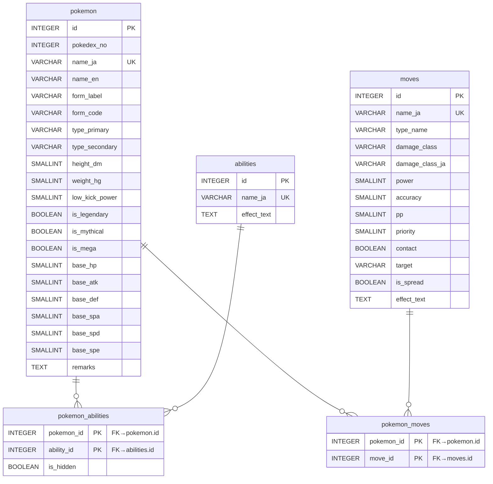

# ポケモンマスターデータベースのスキーマ

各ポケモンや技のマスター情報は、Supabaseに格納している。このドキュメントは、Supabaseのデータベース設計についてまとめてある。

このスキーマに基づき、ユーザーからのリクエストに最適な検索を行うこと。 

## 1. 想定要件とユースケース

- MCP サーバーからの検索を想定し、特定の技を覚えるポケモンや素早さなどの種族値条件を高速に判定できること。
- **バージョン管理**: PostgreSQL のスキーマ機能を使用し、バージョンごとにスキーマを分離する。現在は `champions`（Champions）スキーマを使用。

## 2. スキーマ設計

### 2.1 スキーマ構成

```sql
-- Champions 用スキーマ
CREATE SCHEMA champions;
```

将来的に新バージョンが出た場合は、新しいスキーマを作成:

```sql
-- 例: 次世代用スキーマ
CREATE SCHEMA next_gen;
```

### 2.2 スキーマ分離のメリット

- **バージョン間の独立性**: 各世代のデータが完全に分離され、混在しない
- **比較の容易性**: 世代間でのポケモンデータの変化を比較しやすい
- **段階的移行**: 新バージョンのデータを追加しつつ、旧バージョンも維持可能
- **クエリの明確性**: `champions.pokemon` のようにスキーマ名で対象バージョンが明確

## 3. モデリング方針

- **ポケモン単位の管理**: フォルム分岐は別レコードとして `pokemon` テーブルに格納し、フォーム専用テーブルを廃止。
- **タイプ・種族値は直接カラム化**: タイプは全 18 種類で固定のため列を持たせ、チェック制約で妥当性を担保する。種族値も固定 6 項目を個別カラムで保持する。
- **リレーションの最小化**: 技・特性は参照テーブルを残しつつ、学習経路やアイテム系テーブルは削除。ポケモンと技の関係は 1 つの中間テーブルで表現する。
- **日本語名称を基準**: 多言語展開は想定せず、日本語名称を主要キーに補助的に利用できるようにする。
- **スキーマによるバージョン管理**: 各バージョンは独立したスキーマ（`champions` など）に格納し、将来の拡張に備える。

## 4. テーブル定義

> **注**: 以下のすべてのテーブルは `champions` スキーマ内に作成されます（例: `champions.pokemon`）。

### ER図



### 4.1 `champions.pokemon`

| カラム名 | 型 | 制約 | 説明 |
| --- | --- | --- | --- |
| `id` | INTEGER | PK | 内部 ID |
| `pokedex_no` | INTEGER | NOT NULL | 全国図鑑番号（フォーム違いは同一番号可） |
| `name_ja` | VARCHAR(64) | UNIQUE NOT NULL | ポケモン名（フォーム名込み） |
| `name_en` | VARCHAR(64) |  | ポケモン英語名（フォーム名込み） |
| `form_label` | VARCHAR(64) |  | フォーム名だけを保持（例: 「(ヒスイ)」） |
| `form_code` | VARCHAR(16) |  | 詳細ページURL上のフォーム識別コード（例: `m`, `x`, `y`, `a`, `h`） |
| `type_primary` | VARCHAR(16) | NOT NULL | タイプ 1（チェック制約で 18 種類に限定） |
| `type_secondary` | VARCHAR(16) |  | タイプ 2 |
| `height_dm` | SMALLINT |  | 高さ（デシメートル） |
| `weight_hg` | SMALLINT |  | 重さ（ヘクトグラム） |
| `low_kick_power` | SMALLINT |  | 「けたぐり」「くさむすび」威力換算値 |
| `is_legendary` | BOOLEAN | DEFAULT FALSE | 伝説フラグ |
| `is_mythical` | BOOLEAN | DEFAULT FALSE | 幻フラグ |
| `is_mega` | BOOLEAN | DEFAULT FALSE | メガ進化フラグ |
| `base_hp` | SMALLINT | NOT NULL | 種族値: HP |
| `base_atk` | SMALLINT | NOT NULL | 種族値: 攻撃 |
| `base_def` | SMALLINT | NOT NULL | 種族値: 防御 |
| `base_spa` | SMALLINT | NOT NULL | 種族値: 特攻 |
| `base_spd` | SMALLINT | NOT NULL | 種族値: 特防 |
| `base_spe` | SMALLINT | NOT NULL | 種族値: 素早さ |
| `remarks` | TEXT |  | 備考（例: 入手条件メモ） |

> チェック制約例: `type_primary` と `type_secondary` は `('ノーマル', 'ほのお', ..., 'フェアリー')` に限定しつつ、NULL を許容する。

### 4.2 `champions.abilities`

| カラム名 | 型 | 制約 | 説明 |
| --- | --- | --- | --- |
| `id` | INTEGER | PK | 内部 ID |
| `name_ja` | VARCHAR(64) | UNIQUE NOT NULL | 特性名 |
| `effect_text` | TEXT |  | 効果説明（日本語） |

### 4.3 `champions.pokemon_abilities`

| カラム名 | 型 | 制約 | 説明 |
| --- | --- | --- | --- |
| `pokemon_id` | INTEGER | PK, FK→`pokemon.id` | ポケモン |
| `ability_id` | INTEGER | PK, FK→`abilities.id` | 特性 |
| `is_hidden` | BOOLEAN | NOT NULL DEFAULT FALSE | 夢特性であれば `TRUE` |

### 4.4 `champions.moves`

| カラム名 | 型 | 制約 | 説明 |
| --- | --- | --- | --- |
| `id` | INTEGER | PK | 内部 ID |
| `name_ja` | VARCHAR(64) | UNIQUE NOT NULL | 技名 |
| `type_name` | VARCHAR(16) | NOT NULL | 技タイプ（18 種類でチェック制約） |
| `damage_class` | VARCHAR(16) |  | `physical` / `special` / `status`（NULL許容） |
| `damage_class_ja` | VARCHAR(16) |  | 技分類の日本語表記（`物理` / `特殊` / `変化` / `-`） |
| `power` | SMALLINT |  | 威力 |
| `accuracy` | SMALLINT |  | 命中率 |
| `pp` | SMALLINT |  | 技ポイント |
| `priority` | SMALLINT | DEFAULT 0 | 優先度 |
| `contact` | BOOLEAN |  | 接触技であれば `TRUE`、非接触技であれば `FALSE` |
| `target` | VARCHAR(16) | DEFAULT `'single'` | 技の対象。`single`（相手１体）/ `all_opponents`（相手全体）/ `all_except_self`（自分以外全員）/ `self`（自分自身） |
| `is_spread` | BOOLEAN | DEFAULT FALSE | 全体技補正（×3/4）対象なら `TRUE`（`all_opponents` / `all_except_self`） |
| `effect_text` | TEXT |  | 効果説明 |

### 4.5 `champions.pokemon_moves`

| カラム名 | 型 | 制約 | 説明 |
| --- | --- | --- | --- |
| `pokemon_id` | INTEGER | PK, FK→`pokemon.id` | ポケモン |
| `move_id` | INTEGER | PK, FK→`moves.id` | 技 |

> 学習手段の区別は保有しない。ポケモンと技の関連のみを管理する。

## 5. インデックス設計

### 5.1 `champions.pokemon` テーブルのインデックス

| インデックス名 | 対象カラム | 種類 | 目的 |
| --- | --- | --- | --- |
| `pokemon_pkey` | `id` | PK | 主キー（自動作成） |
| `pokemon_name_ja_key` | `name_ja` | UNIQUE | ポケモン名の一意性保証（自動作成） |
| `idx_pokemon_pokedex_no` | `pokedex_no` | B-tree | 図鑑番号での検索 |
| `idx_pokemon_base_spe` | `base_spe` | B-tree | 素早さ種族値での範囲検索（例: `base_spe >= 102`） |
| `idx_pokemon_is_legendary` | `is_legendary` | B-tree | 伝説ポケモンフィルタ |
| `idx_pokemon_is_mythical` | `is_mythical` | B-tree | 幻ポケモンフィルタ |
| `idx_pokemon_is_mega` | `is_mega` | B-tree | メガ進化ポケモンフィルタ |
| `idx_pokemon_type_normal` | 部分インデックス | B-tree | ノーマルタイプ検索（`type_primary = 'ノーマル' OR type_secondary = 'ノーマル'`） |
| `idx_pokemon_type_fire` | 部分インデックス | B-tree | ほのおタイプ検索（`type_primary = 'ほのお' OR type_secondary = 'ほのお'`） |
| `idx_pokemon_type_water` | 部分インデックス | B-tree | みずタイプ検索（`type_primary = 'みず' OR type_secondary = 'みず'`） |
| `idx_pokemon_type_electric` | 部分インデックス | B-tree | でんきタイプ検索（`type_primary = 'でんき' OR type_secondary = 'でんき'`） |
| `idx_pokemon_type_grass` | 部分インデックス | B-tree | くさタイプ検索（`type_primary = 'くさ' OR type_secondary = 'くさ'`） |
| `idx_pokemon_type_ice` | 部分インデックス | B-tree | こおりタイプ検索（`type_primary = 'こおり' OR type_secondary = 'こおり'`） |
| `idx_pokemon_type_fighting` | 部分インデックス | B-tree | かくとうタイプ検索（`type_primary = 'かくとう' OR type_secondary = 'かくとう'`） |
| `idx_pokemon_type_poison` | 部分インデックス | B-tree | どくタイプ検索（`type_primary = 'どく' OR type_secondary = 'どく'`） |
| `idx_pokemon_type_ground` | 部分インデックス | B-tree | じめんタイプ検索（`type_primary = 'じめん' OR type_secondary = 'じめん'`） |
| `idx_pokemon_type_flying` | 部分インデックス | B-tree | ひこうタイプ検索（`type_primary = 'ひこう' OR type_secondary = 'ひこう'`） |
| `idx_pokemon_type_psychic` | 部分インデックス | B-tree | エスパータイプ検索（`type_primary = 'エスパー' OR type_secondary = 'エスパー'`） |
| `idx_pokemon_type_bug` | 部分インデックス | B-tree | むしタイプ検索（`type_primary = 'むし' OR type_secondary = 'むし'`） |
| `idx_pokemon_type_rock` | 部分インデックス | B-tree | いわタイプ検索（`type_primary = 'いわ' OR type_secondary = 'いわ'`） |
| `idx_pokemon_type_ghost` | 部分インデックス | B-tree | ゴーストタイプ検索（`type_primary = 'ゴースト' OR type_secondary = 'ゴースト'`） |
| `idx_pokemon_type_dragon` | 部分インデックス | B-tree | ドラゴンタイプ検索（`type_primary = 'ドラゴン' OR type_secondary = 'ドラゴン'`） |
| `idx_pokemon_type_dark` | 部分インデックス | B-tree | あくタイプ検索（`type_primary = 'あく' OR type_secondary = 'あく'`） |
| `idx_pokemon_type_steel` | 部分インデックス | B-tree | はがねタイプ検索（`type_primary = 'はがね' OR type_secondary = 'はがね'`） |
| `idx_pokemon_type_fairy` | 部分インデックス | B-tree | フェアリータイプ検索（`type_primary = 'フェアリー' OR type_secondary = 'フェアリー'`） |

> **部分インデックスについて**: タイプ検索は `type_primary` と `type_secondary` のどちらかに該当タイプが含まれるかを判定する必要があるため、各タイプごとに部分インデックスを作成。これにより、「ほのおタイプのポケモン」のような検索が高速化される。

### 5.2 `champions.abilities` テーブルのインデックス

| インデックス名 | 対象カラム | 種類 | 目的 |
| --- | --- | --- | --- |
| `abilities_pkey` | `id` | PK | 主キー（自動作成） |
| `abilities_name_ja_key` | `name_ja` | UNIQUE | 特性名の一意性保証（自動作成） |

### 5.3 `champions.pokemon_abilities` テーブルのインデックス

| インデックス名 | 対象カラム | 種類 | 目的 |
| --- | --- | --- | --- |
| `pokemon_abilities_pkey` | `(pokemon_id, ability_id)` | PK | 主キー（自動作成） |
| `idx_pokemon_abilities_ability_id` | `(ability_id, pokemon_id)` | B-tree | 特性からポケモンを逆引き検索 |
| `idx_pokemon_abilities_is_hidden` | `is_hidden` | B-tree | 夢特性フィルタ |

### 5.4 `champions.moves` テーブルのインデックス

| インデックス名 | 対象カラム | 種類 | 目的 |
| --- | --- | --- | --- |
| `moves_pkey` | `id` | PK | 主キー（自動作成） |
| `moves_name_ja_key` | `name_ja` | UNIQUE | 技名の一意性保証（自動作成） |
| `idx_moves_type_name` | `type_name` | B-tree | 技タイプでの絞り込み |
| `idx_moves_damage_class` | `damage_class` | B-tree | 物理/特殊/変化での絞り込み |

### 5.5 `champions.pokemon_moves` テーブルのインデックス

| インデックス名 | 対象カラム | 種類 | 目的 |
| --- | --- | --- | --- |
| `pokemon_moves_pkey` | `(pokemon_id, move_id)` | PK | 主キー（自動作成） |
| `idx_pokemon_moves_move_id` | `(move_id, pokemon_id)` | B-tree | 特定技を覚えるポケモン検索（逆引き） |
